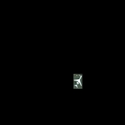

# Object-Detection-in-Satellite-Images
To train a deep learning model which can identify various objects in satellite images
 
 

## Generating Masks for model training
 

 

## Image Augmentation
 

